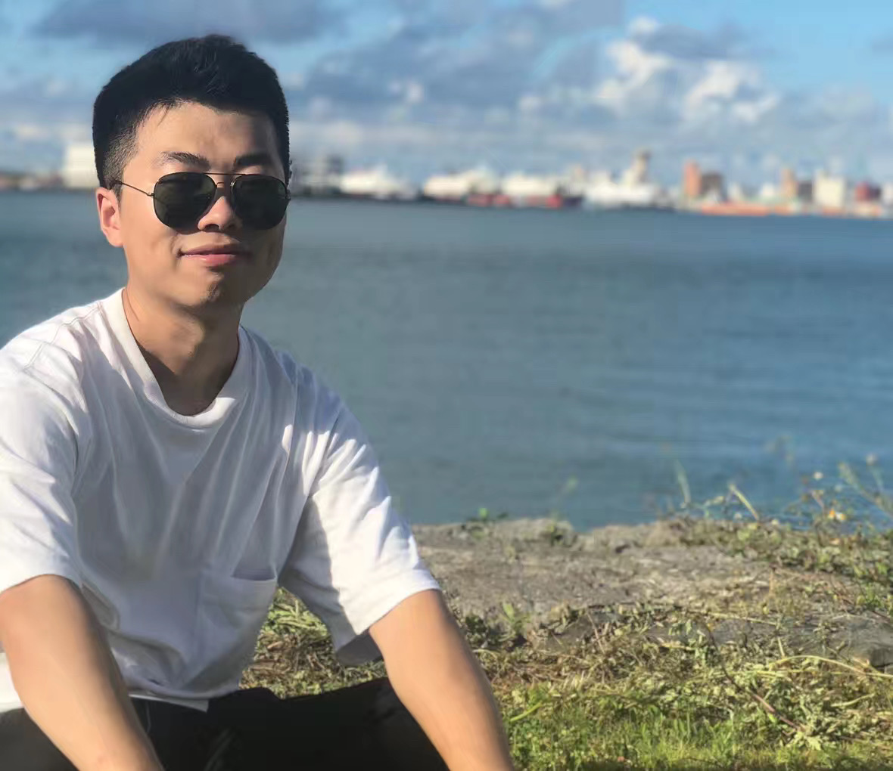

<!-- (comment) the image below can be found in img folder of this very project-->
{: style="float: right; margin: 0px 20px; width: 204px; height: 176px" name="fox"}

Now, I'm an algorithm researcher at [WeChat AI](https://ai.weixin.qq.com/), Tencent. 

Prior to joining Tencent, I recieved my master’s degree from the CAS Key Lab of Parallel Software and Scientific Computing in Institute of Software, Chinese Academy of Sciences under the supervision of Prof.GuoPing Long in July 2018. 

Meanwhile, I visited The Hong Kong Polytechnic University as a research assistant under the supervision of Prof.[Wenjie Li](http://www4.comp.polyu.edu.hk/~cswjli/) for half a year in 2017-2018.

Before that, I received my bachelor’s degree in Software Engineering and bachelor’s degree in Geoscience from China University of Geosciences, Wuhan in 2015.

## News 

* 04/2020 Diversifying Dialogue Generation with Non-Conversational Text is _accepted to __ACL__ 2020_. 
* 04/2020 Neural Data-to-Text Generation via Jointly Learning the Segmentation and Correspondence is _accepted to __ACL__ 2020_. 
* 11/2019 Giving two talks at EMNLP HongKong, China.
* 07/2019 Giving talk at ACL Florence, Italy.  
* 07/2019 __2__ papers _accepted to __EMNLP__ 2019_!
* 05/2019 Improving Multi-turn Dialogue Modelling with Utterance ReWriter is _accepted to __ACL__ 2019_.

